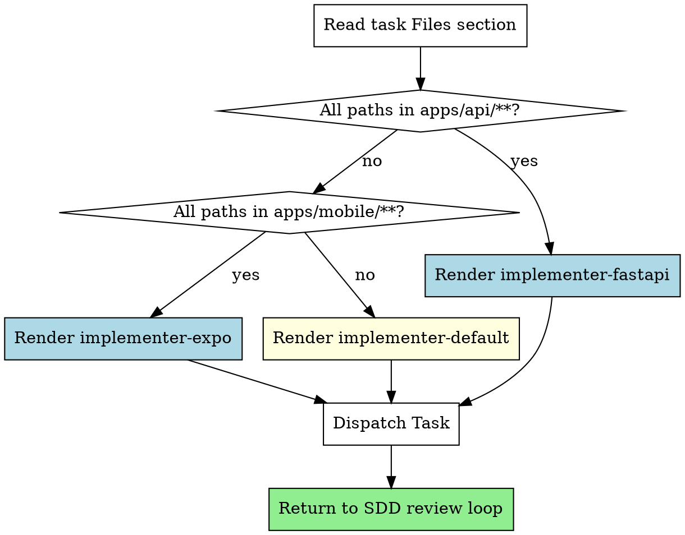

# Dispatching Domain Agents

Layer on top of subagent-driven-development (SDD). When SDD's orchestrator is about to dispatch an implementer subagent for a task, this skill picks a domain-specific implementer prompt template based on the task's primary file paths. Domain-aware prompts produce stack-correct code (async SQLAlchemy for FastAPI tasks, expo-router for Expo tasks) that the generic upstream prompt would miss.

**Core principle:** Route by file path. One template per task. Default to fallback.

**Announce at start:** "I'm using the dispatching-domain-agents skill to pick the {fastapi|expo|default} implementer template."

## When to Use

- Run whenever SDD is about to dispatch an implementer subagent. It's a routing helper that runs once per task — not a replacement for SDD's flow. After dispatch, return to SDD's normal review loop.
- Do NOT use this skill when the project lacks the framework's `apps/api/` and `apps/mobile/` layout (it assumes the convention from `scaffolding-saas-project`).
- Do NOT use this skill for non-implementation tasks (docs, planning, research) — SDD doesn't dispatch implementers for those.

## The Routing Table

| Priority | Predicate | Template |
|---|---|---|
| 1 | All file paths in the task's "Files:" section match `apps/api/**` (no exceptions) | `templates/implementer-fastapi.md` |
| 2 | All file paths match `apps/mobile/**` (no exceptions) | `templates/implementer-expo.md` |
| 3 | Anything else (mixed paths, paths outside `apps/`, no recognizable layer) | `templates/implementer-default.md` |

Mixed-path tasks fall through to default — the implementer needs cross-layer awareness, which the specialized templates don't provide.

## Process

1. **Read the task's Files section.** Extract all paths under "Create:", "Modify:", "Test:".
2. **Apply the routing predicate in priority order.** First match wins.
3. **Render the chosen template.** Substitute placeholders with task-specific context (`{TASK_NUMBER}`, `{TASK_NAME}`, `{TASK_DESCRIPTION}`, `{CONTEXT}`, `{WORKING_DIRECTORY}`).
4. **Dispatch the Task.** `Task(subagent_type=general-purpose, description=..., prompt=<rendered template>)`.
5. **Return to SDD's normal flow.** Wait for implementer report, run spec compliance review, run code quality review.

## Flow

## Integration with subagent-driven-development

This skill runs at SDD's "Dispatch implementer subagent" step. Instead of using the default `subagent-driven-development/implementer-prompt.md`, the SDD orchestrator consults this skill to pick a domain-aware template. After dispatch, SDD's review loop (spec compliance → code quality) proceeds unchanged.

## Routing Predicate Validation

| Test task — Files: section paths | Expected template |
|---|---|
| `apps/api/app/routers/notes.py` only | `implementer-fastapi.md` |
| `apps/api/app/models/note.py` AND `apps/api/alembic/versions/0001_notes.py` | `implementer-fastapi.md` |
| `apps/mobile/app/notes/index.tsx` only | `implementer-expo.md` |
| `apps/mobile/app/notes/index.tsx` AND `apps/mobile/lib/store.ts` | `implementer-expo.md` |
| `apps/api/app/routers/notes.py` AND `apps/mobile/app/notes/index.tsx` | `implementer-default.md` (mixed) |
| `scripts/seed.py` only | `implementer-default.md` (outside apps/) |
| `infra/docker-compose.yml` only | `implementer-default.md` |
| `apps/api/alembic/versions/0042_add_orgs.py` only | `implementer-fastapi.md` |
| `apps/api/tests/test_notes.py` AND `apps/api/app/routers/notes.py` | `implementer-fastapi.md` |
| `README.md` only | `implementer-default.md` |

Validation walked through manually during initial implementation — all rows produce the expected template under the routing rule above.

## Adding a New Template

1. Drop a new `implementer-<name>.md` under `templates/` with the same envelope as existing templates (header + Task tool block + placeholders + stack-specific guidance + anti-patterns).
2. Add a row to the routing table at the appropriate priority. Choose the predicate carefully — overlap with existing predicates breaks the "first match wins" rule.
3. Build a planted task fixture and validate via the existing pressure-test loop (RED with default template + GREEN with new template). The expected pattern is comparative: same fixture, same model, RED with default vs GREEN with the new template — GREEN should not regress on RED's checks AND should add observable template-specific improvements.
4. Commit fixture and template together.

## Anti-Patterns

**Don't:**
- Dispatch multiple templates for one task (exactly one fires per task).
- Use a specialized template for a mixed-path task — fall back to default. Cross-layer awareness matters.
- Skip the announce step — the user/orchestrator needs to know which template was chosen.
- Fork upstream's `subagent-driven-development/implementer-prompt.md` content into specialized templates without keeping `implementer-default.md` in sync. When upstream improves the prompt, propagate to default first, then re-merge into specialized variants.
- Add a new template without a planted fixture and pressure-test — untested templates are worse than no template (they give false confidence).

## Future Templates

Future templates not in initial scope, added per real-world need: `implementer-nextjs.md` (when web admin work begins), `implementer-infra.md` (Docker/Terraform/CI), `implementer-database.md` (migration-heavy or schema-design tasks). Each requires a planted task fixture and pressure test before merging.
