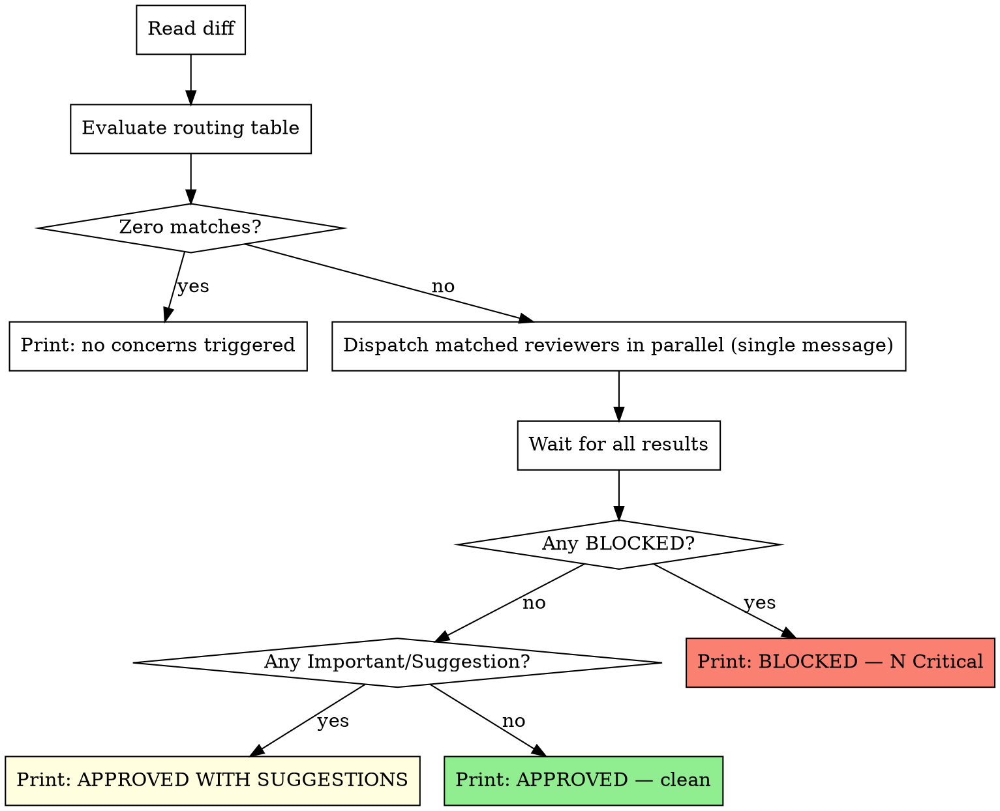

# Multi-Angle Review

Dispatch role-specific reviewer subagents — multitenant-isolation, migration-safety, and security — based on what the diff actually touches. Each reviewer is a focused specialist; routing ensures only the reviewers relevant to the change are dispatched. Critical findings from any reviewer block the same way the standard reviewer's Critical findings do.

**Core principle:** Route first. Dispatch in parallel. Block on Critical.

**Announce at start:** "I'm using the multi-angle-review skill to dispatch role-specific reviewers."

## When to Use

Run multi-angle-review after `requesting-code-review` returns APPROVED. It is a follow-up pass, not a replacement. The standard reviewer catches general code quality and correctness; multi-angle-review dispatches specialists that go deeper on specific risk surfaces.

**Do not run multi-angle-review before the standard `requesting-code-review` reviewer.** The standard reviewer must pass first.

## The Routing Table

Evaluate the diff against each predicate. A predicate matches when its file glob AND any content condition are both true. Multiple predicates can match the same diff — dispatch all matched reviewers.

**Predicates are soft signals — when in doubt, dispatch.** False-positive cost is one extra reviewer run (a few minutes); false-negative cost is a shipped Critical. Be liberal at the routing layer; the reviewer's own severity rules filter out non-issues.

| Trigger | Agent | Concern |
|---|---|---|
| Diff touches any `**/*.py` AND introduces or changes a `select()`/`update()`/`delete()`/`db.get()` or aggregate (`func.count(...)`, `func.sum(...)`, `func.avg(...)`) against an org-scoped model OR a route/script/worker accessing org-scoped data. Path is not constrained to `apps/api/**` — backfills under `scripts/`, workers under `apps/worker/`, jobs under `apps/jobs/`, or any other location must also fire this reviewer. | `reviewer-multitenant-isolation` | Tenant boundary correctness |
| Diff touches `**/alembic/versions/*.py` (new file or modified). For non-Alembic migrations (raw `*.sql` under `**/migrations/`, other migration tools), dispatch this reviewer with a `non-alembic; reviewer applies general principles` note in the `DESCRIPTION` field — the canonical patterns still apply, but the path-shape assumption doesn't. | `reviewer-migration-safety` | Production-safe migrations |
| Diff touches `**/auth/**`, `**/billing/**`, any new HTTP / webhook handler, OR any `**/*.py` introducing any of: secret handling; password hashing; SQL composition; shell or command execution (`subprocess`, `os.system`); **dynamic code execution** (`eval`, `exec`, `compile`, `__import__`); **deserialization of untrusted bytes** (`pickle.loads`, `yaml.load` without `Loader=yaml.SafeLoader`, `marshal.loads`, `dill.loads`, `jsonpickle.decode`); **redirect or URL construction from user input** (`RedirectResponse`, `redirect`, `Location` header); **regex compilation against user-controlled input**; **XML/HTML parsing** that could expand external entities (`lxml.etree`, `xml.etree`, `xml.dom`); **outbound network calls with a user-controlled host** (`httpx`, `requests`, `urllib.request`, `socket.connect`). | `reviewer-security` | Security defects |

## Process

**1. Read the diff.**

```bash
git diff <base>..HEAD --stat   # overview of what changed
git diff <base>..HEAD          # full content if needed
```

If no git range is available, read the modified files directly.

**2. Evaluate each routing-table predicate against the diff.** Record which templates fire. A template fires when its predicate is satisfied — do not skip a match because "the change is small" or "it's probably fine."

**3. If zero templates fire:** print `multi-angle-review: no concerns triggered by this diff` and exit cleanly. No reviewers needed.

**4. If one or more agents fire:** dispatch all matched reviewers as PARALLEL `Task` calls in a SINGLE message — multiple Task tool uses in one assistant turn. Do not dispatch them sequentially. Each Task call uses `subagent_type=<agent-name>` (e.g., `subagent_type=reviewer-multitenant-isolation`); the agent's system prompt holds the canonical patterns, severity rules, output format, and anti-patterns.

The per-call `prompt` for each Task is a structured context block — three labeled fields, no template rendering:

```
DESCRIPTION: <brief summary of what was built>
PLAN_OR_REQUIREMENTS: <plan file path, task text, or requirements>
FILES_TO_REVIEW: <the file subset relevant to THIS reviewer — not all changed files, only those that triggered its predicate>
```

**Before dispatching, verify the per-call block has all three fields populated.** A missing or empty field would cause the agent to hallucinate a review on no context. If any field is empty: refuse to dispatch that reviewer, surface which field is missing, and require the caller to fill it in. This substep is the only mechanical guard between "forgot to fill the field" and "reviewer produces a confident review on empty context" — don't skip it.

**5. Wait for all reviewer subagents to return.** Do not aggregate partial results.

**6. Render the summary table.**

```
| Reviewer | Verdict | Critical | Important | Suggestion |
|---|---|---|---|---|
| multitenant-isolation | BLOCKED | 3 | 0 | 1 |
| migration-safety | APPROVED | 0 | 0 | 0 |
| security | APPROVED WITH SUGGESTIONS | 0 | 1 | 2 |
```

**7. If any reviewer returned BLOCKED:** print the final verdict and inline all Critical findings.

```
BLOCKED — N total Critical finding(s) across M reviewer(s)
```

For each Critical finding: `file:line`, what's wrong, why it matters, how to fix. Group by reviewer.

**8. If no BLOCKED but Important or Suggestion findings exist:** print `APPROVED WITH SUGGESTIONS` and list findings grouped by severity, then by reviewer.

**9. If all reviewers returned APPROVED:** print `APPROVED — multi-angle review clean`.

## Flow



## Error Handling

Cases where the happy path doesn't apply. Default posture is **fail closed** — if you can't be sure the review actually happened, do not approve.

**Reviewer subagent times out.** Default timeout is 300 s per reviewer. If a Task does not return: print `BLOCKED — reviewer <name> did not return within timeout`, list the verdicts of any reviewers that did complete, and stop. Do not aggregate to APPROVED on a missing reviewer.

**Agent not discoverable.** Before dispatch, verify each matched agent file exists at `agents/<agent-name>.md` (relative to the plugin root) with `ls`/`Read`. If a file is missing or unreadable, the `Task(subagent_type=<agent-name>)` call will fail with an "unknown agent" error. Surface the exact path and error, refuse to dispatch the rest, and instruct the user to fix before retrying. Don't skip the broken reviewer and continue with the partial set unless the user explicitly opts in.

**Two reviewers flag the same `file:line` at different severities.** Take the **maximum** severity (Critical > Important > Suggestion) and merge into a single finding annotated `flagged by: <reviewer-1>, <reviewer-2>`. This is a soft rule — use judgment; if the two reviewers describe distinct underlying defects at the same line, keep them as separate findings.

**Reviewer returns a malformed verdict line.** A "well-formed" verdict ends in exactly one of: `BLOCKED — N Critical finding(s)`, `APPROVED WITH SUGGESTIONS`, or `APPROVED`. If the output ends in something else, re-prompt the same reviewer once with: *"Your previous response did not end in one of the three permitted verdict lines. Re-emit the verdict line exactly, without changing your findings."* If the second response is still malformed, treat as `BLOCKED — reviewer <name> output unparseable`.

**Empty diff or no files to review.** Step 3 of Process already handles zero-fire (`no concerns triggered`). If `FILES_TO_REVIEW` is empty for a matched reviewer (e.g., the predicate matched but the file subset filters down to nothing), do not dispatch — surface the inconsistency and stop. Do not invent files.

## Integration with `requesting-code-review`

This skill runs as a follow-up to `requesting-code-review`. After the standard code-reviewer returns APPROVED, run multi-angle-review to dispatch the specialized reviewers. Critical findings from multi-angle-review block the same way the standard reviewer's Critical findings do — fix them before merging.

## Adding a New Reviewer Agent

1. Drop a new `reviewer-<name>.md` under `/agents/` (at the plugin root) following the structure of existing reviewer agents — frontmatter (`name`, `description`, `color: red`), opening role statement, `## Per-Call Context` block, canonical pattern, severity rules (Critical/Important/Suggestion), output format, anti-patterns, example output. The `name` in the frontmatter MUST equal the filename minus `.md` — that's the `subagent_type` lookup key.
2. Add a row to the routing table with a precise predicate (file glob + content condition) and concern label. The Agent column holds the bare agent name (e.g., `reviewer-perf`), not a path.
3. Build a planted-bug fixture that satisfies the new predicate and contains at least one Critical finding (RED baseline: reviewer returns BLOCKED).
4. Write the agent body until the reviewer catches all planted bugs (GREEN).
5. Run a clean counter-fixture (no bugs planted) and confirm the reviewer returns APPROVED (no false positives).
6. Commit the fixture and agent together.

## Anti-Patterns

**Don't:**
- Run multi-angle-review BEFORE the standard `requesting-code-review` reviewer
- Skip reviewers because "the diff is small" — predicates exist for a reason
- Dispatch matched reviewers sequentially when they could be parallel
- Include all changed files in every reviewer's `{FILES_TO_REVIEW}` — give each reviewer only the files that triggered its predicate
- Escalate Important to Critical to inflate severity
- Aggregate findings until ALL reviewer subagents have returned
- Print individual reviewer raw outputs when the summary table is expected

## Future Reviewers

Future reviewer agents not in initial scope, added per real-world need: `reviewer-accessibility`, `reviewer-perf`, `reviewer-mobile-platform`, `reviewer-api-contract`, `reviewer-billing-correctness`. Each requires a planted-bug fixture (RED → agent body → GREEN) before merging.
