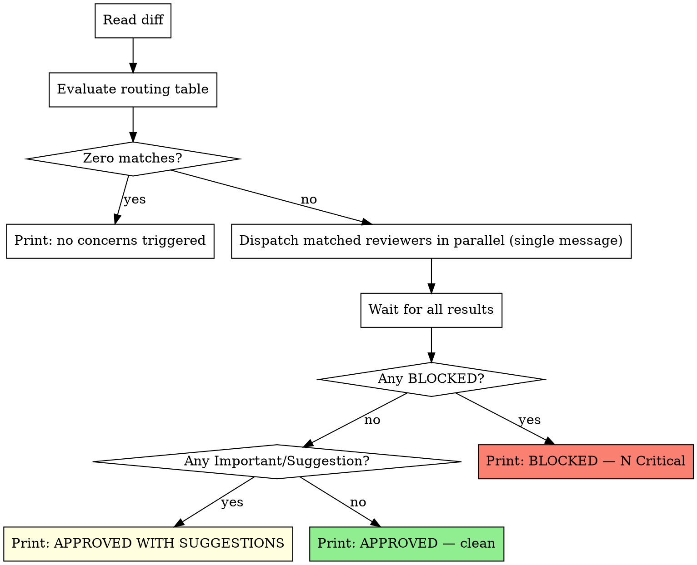

# Multi-Angle Review

Dispatch role-specific reviewer subagents — multitenant-isolation, migration-safety, and security — based on what the diff actually touches. Each reviewer is a focused specialist; routing ensures only the reviewers relevant to the change are dispatched. Critical findings from any reviewer block the same way the standard reviewer's Critical findings do.

**Core principle:** Route first. Dispatch in parallel. Block on Critical.

**Announce at start:** "I'm using the multi-angle-review skill to dispatch role-specific reviewers."

## When to Use

Run multi-angle-review after `requesting-code-review` returns APPROVED. It is a follow-up pass, not a replacement. The standard reviewer catches general code quality and correctness; multi-angle-review dispatches specialists that go deeper on specific risk surfaces.

**Do not run multi-angle-review before the standard `requesting-code-review` reviewer.** The standard reviewer must pass first.

## The Routing Table

Evaluate the diff against each predicate. A predicate matches when its file glob AND any content condition are both true. Multiple predicates can match the same diff — dispatch all matched reviewers.

| Trigger | Template | Concern |
|---|---|---|
| Diff touches `apps/api/**/*.py` AND introduces or changes a `select()`/`update()`/`delete()`/`db.get()` against an org-scoped model OR a route accessing org-scoped data | `templates/reviewer-multitenant-isolation.md` | Tenant boundary correctness |
| Diff touches `**/alembic/versions/*.py` (new file or modified) | `templates/reviewer-migration-safety.md` | Production-safe migrations |
| Diff touches `apps/api/**/auth/**`, `apps/api/**/billing/**`, any new HTTP/webhook handler, any code introducing secret handling, password hashing, SQL composition, command execution | `templates/reviewer-security.md` | Security defects |

## Process

**1. Read the diff.**

```bash
git diff <base>..HEAD --stat   # overview of what changed
git diff <base>..HEAD          # full content if needed
```

If no git range is available, read the modified files directly.

**2. Evaluate each routing-table predicate against the diff.** Record which templates fire. A template fires when its predicate is satisfied — do not skip a match because "the change is small" or "it's probably fine."

**3. If zero templates fire:** print `multi-angle-review: no concerns triggered by this diff` and exit cleanly. No reviewers needed.

**4. If one or more templates fire:** dispatch all matched reviewers as PARALLEL `Task(subagent_type=general-purpose)` calls in a SINGLE message — multiple Task tool uses in one assistant turn. Do not dispatch them sequentially.

Fill in each template's placeholders:
- `{DESCRIPTION}` — brief summary of what was built
- `{PLAN_OR_REQUIREMENTS}` — plan file path, task text, or requirements
- `{FILES_TO_REVIEW}` — the file subset relevant to that reviewer (not all changed files — only those that triggered its predicate)

**5. Wait for all reviewer subagents to return.** Do not aggregate partial results.

**6. Render the summary table.**

```
| Reviewer | Verdict | Critical | Important | Suggestion |
|---|---|---|---|---|
| multitenant-isolation | BLOCKED | 3 | 0 | 1 |
| migration-safety | APPROVED | 0 | 0 | 0 |
| security | APPROVED WITH SUGGESTIONS | 0 | 1 | 2 |
```

**7. If any reviewer returned BLOCKED:** print the final verdict and inline all Critical findings.

```
BLOCKED — N total Critical finding(s) across M reviewer(s)
```

For each Critical finding: `file:line`, what's wrong, why it matters, how to fix. Group by reviewer.

**8. If no BLOCKED but Important or Suggestion findings exist:** print `APPROVED WITH SUGGESTIONS` and list findings grouped by severity, then by reviewer.

**9. If all reviewers returned APPROVED:** print `APPROVED — multi-angle review clean`.

## Flow



## Integration with `requesting-code-review`

This skill runs as a follow-up to `requesting-code-review`. After the standard code-reviewer returns APPROVED, run multi-angle-review to dispatch the specialized reviewers. Critical findings from multi-angle-review block the same way the standard reviewer's Critical findings do — fix them before merging.

## Adding a New Reviewer Template

1. Drop a new `reviewer-<name>.md` under `templates/` following the structure of existing templates (purpose, Task tool block with prompt, placeholders, example output).
2. Add a row to the routing table with a precise predicate (file glob + content condition) and concern label.
3. Build a planted-bug fixture that satisfies the new predicate and contains at least one Critical finding (RED baseline: reviewer returns BLOCKED).
4. Write the template until the reviewer catches all planted bugs (GREEN).
5. Run a clean counter-fixture (no bugs planted) and confirm the reviewer returns APPROVED (no false positives).
6. Commit the fixture and template together.

## Anti-Patterns

**Don't:**
- Run multi-angle-review BEFORE the standard `requesting-code-review` reviewer
- Skip reviewers because "the diff is small" — predicates exist for a reason
- Dispatch matched reviewers sequentially when they could be parallel
- Include all changed files in every reviewer's `{FILES_TO_REVIEW}` — give each reviewer only the files that triggered its predicate
- Escalate Important to Critical to inflate severity
- Aggregate findings until ALL reviewer subagents have returned
- Print individual reviewer raw outputs when the summary table is expected

## Future Reviewers

Future reviewer templates not in initial scope, added per real-world need: `reviewer-accessibility.md`, `reviewer-perf.md`, `reviewer-mobile-platform.md`, `reviewer-api-contract.md`, `reviewer-billing-correctness.md`. Each requires a planted-bug fixture (RED → template → GREEN) before merging.
